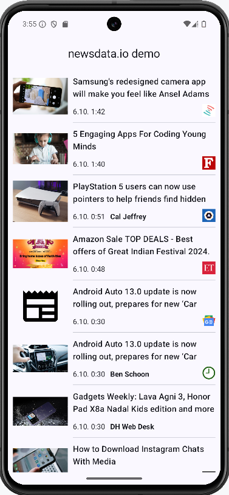

# News Reader App

## 🎯 Objective

This is a simple Android application that loads news articles using the [NewsData.io API](https://newsdata.io/docs). The app is designed to handle a basic login flow and provide users with the ability to browse and view details of news articles, with additional features to share articles via other apps.

## 🚀 Features

### 1. **Static Login**
- Users can log in using the static credentials:
  - **Email:** `elonga@elonga.com`
  - **Password:** `ElongaTheBest`
- If the credentials are correct, the app attaches an API key (X-ACCESS-KEY) to requests to the NewsData.io API.
- If the user skips the login, the news feed will not load, and a message will be displayed on the home screen prompting them to log in.

### 2. **Fetching News Articles**
- After successful login, the user is redirected to the main screen where a list of news articles from NewsData.io is loaded.
- News articles are loaded once and presented to the user as a summary list.

### 3. **Article Details**
- Users can click on an article to view detailed information.
- Each detailed article view includes:
  - Full title and description.
  - Source and publication date.
  - Option to share the article via available apps on the device (e.g., email, social media).

## 🏅 Bonus Features (Optional)
- Implement pagination for articles to load more news.
- Add search functionality for users to filter news by keywords.
- Cache news articles locally to improve performance and handle offline access.
- Use animations or transitions for smoother user experience when navigating between screens.

## 💻 Technologies Used
- **Kotlin:** The primary language for Android app development.
- **Retrofit:** For making API requests.
- **ViewModel + LiveData:** To manage UI-related data lifecycle.
- **Coroutines:** For handling background operations.
- **Glide/Coil:** For loading images in news articles.
- **Jetpack Navigation:** For managing in-app navigation between screens.

## 🛠 Setup

1. Clone the repository.
2. Create a `local.properties` file in the project’s root directory and add your NewsData.io API key: NEWS_API_KEY=your_api_key
3. Build and run the project using Android Studio.

## 📱 Screenshots

| Login Screen | News List | Article Detail |  
|--------------|-----------|----------------|
| _[Login Image]_ |  | _[Detail Image]_ |
